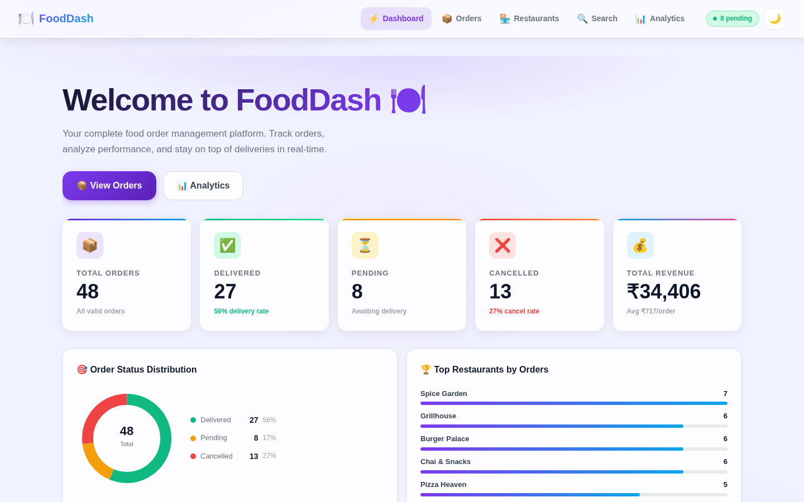
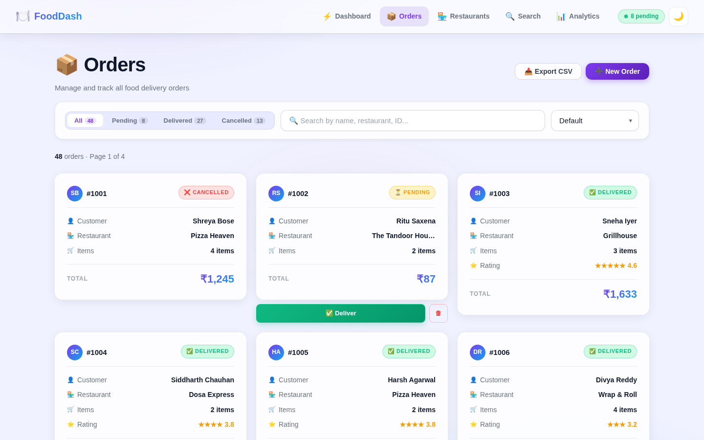
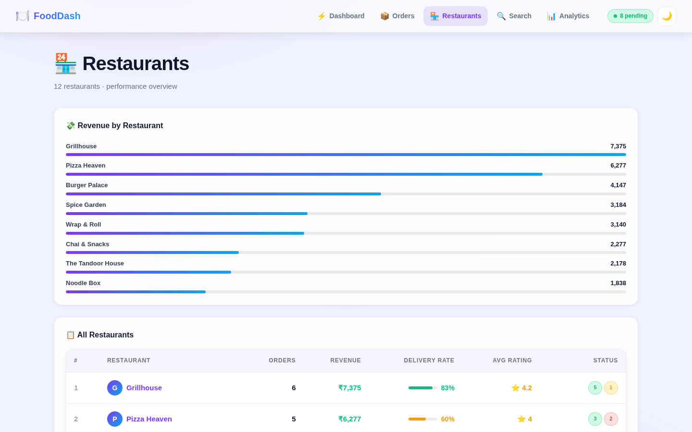
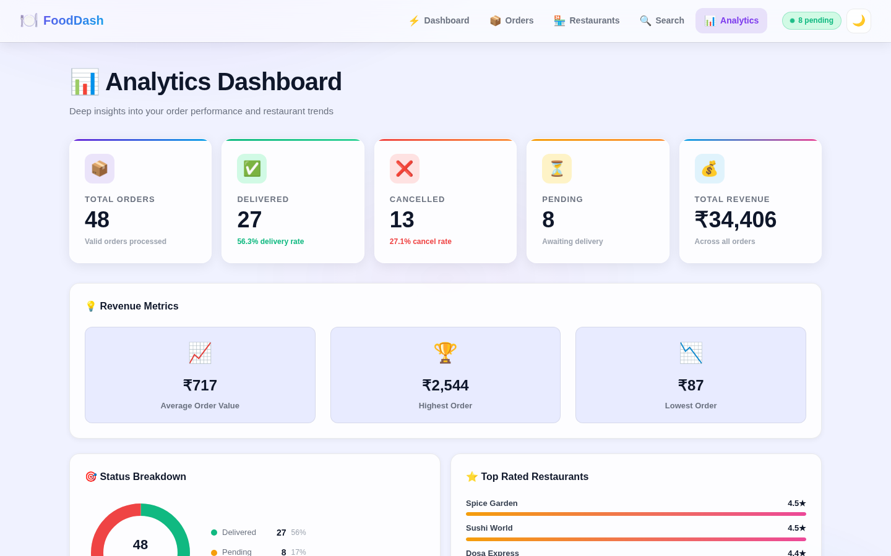
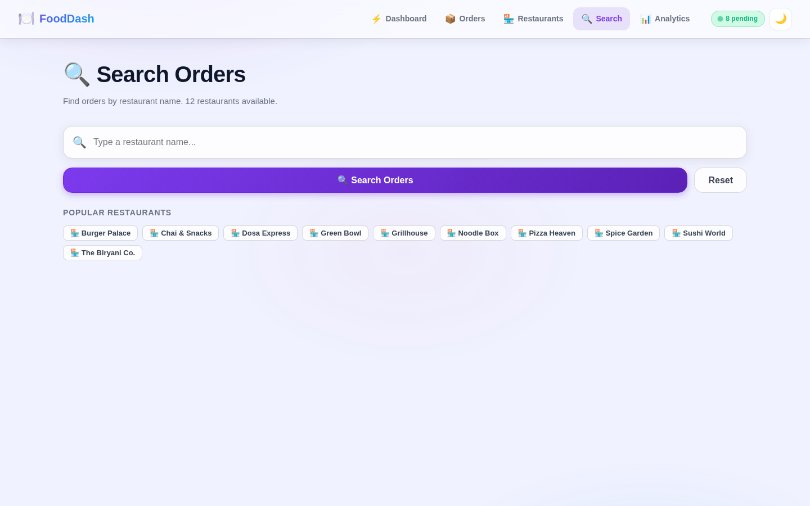
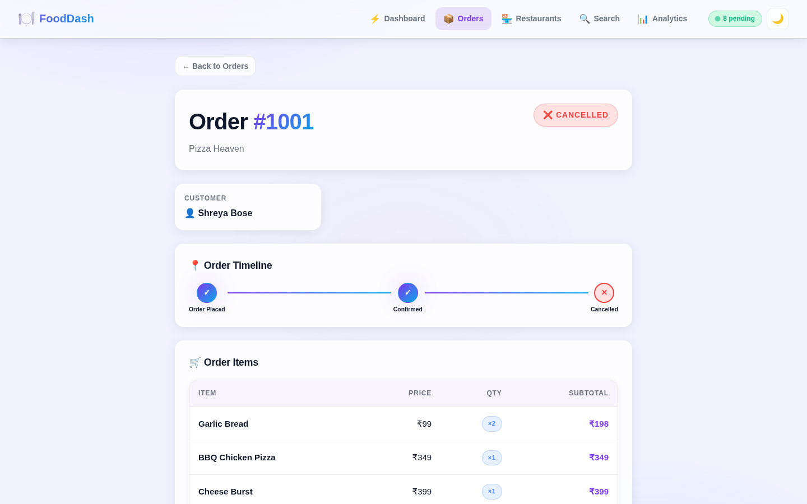
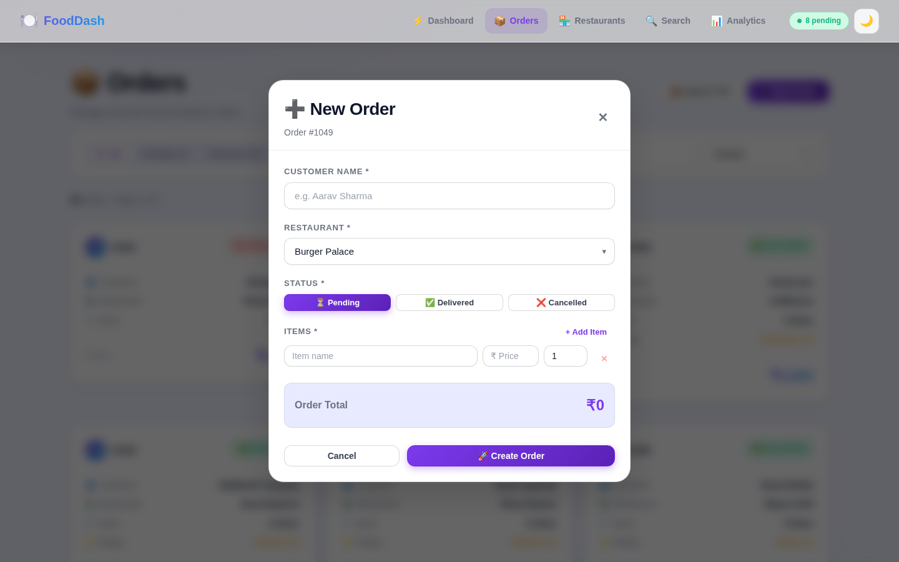
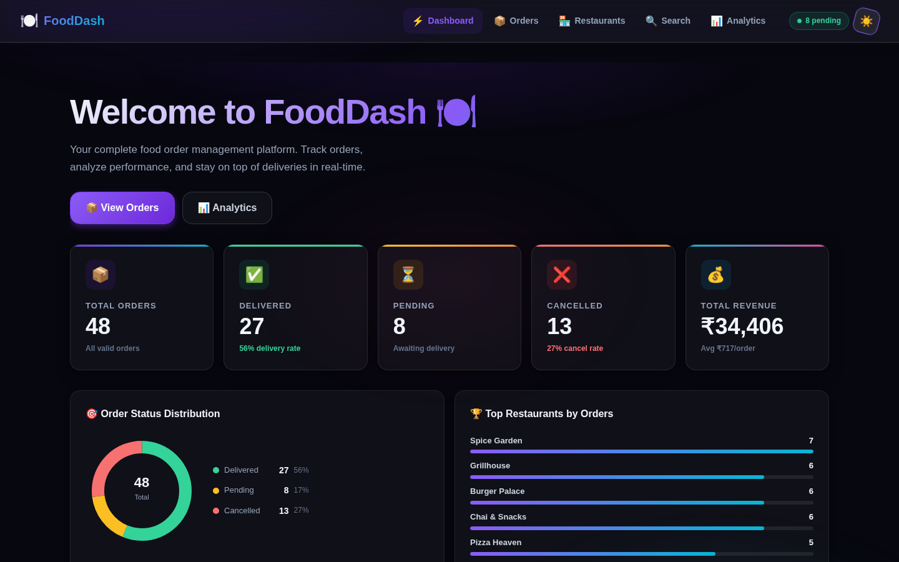

<div align="center">

# 🍽️ FoodDash

### Production-Grade Food Order Management Dashboard

A beautiful, fully functional food delivery operations platform built with React. Track orders, analyze restaurant performance, manage deliveries, and export data — all in one place.

[](https://react.dev)
[](https://vite.dev)
[](https://reactrouter.com)
[](LICENSE)
[](https://github.com/Sandeepsrinivasan-14/pcp-v-assessment-2/pulls)

</div>

---

## ✨ Features

| Feature | Description |
|---|---|
| 📊 **Analytics Dashboard** | Live KPI cards, animated counters, donut chart, revenue bar charts |
| 📦 **Order Management** | Filter by status, search, sort, paginate, mark delivered, delete |
| ➕ **Create Orders** | Full-form modal with real-time total calculation and validation |
| 🏪 **Restaurant Analytics** | Revenue, delivery rate, ratings, order volume per restaurant |
| 🔍 **Smart Search** | Autocomplete search with restaurant quick-picks |
| 📥 **Export to CSV** | One-click export of any filtered view to CSV |
| 🌙 **Dark / Light Mode** | Full theme toggle persisted to localStorage |
| 💎 **3D Card Effects** | Mouse-tracking perspective tilt on all order cards |
| ✨ **Glassmorphism UI** | Backdrop-filter glass cards with animated gradient background |
| ⚡ **Skeleton Loaders** | Shimmer loading state on every page |
| 🔔 **Toast Notifications** | Slide-in toasts for every user action |
| 📱 **Fully Responsive** | Works beautifully on desktop, tablet, and mobile |

---

## 📸 Screenshots

### Dashboard


### Orders — with Filter, Search & Sort


### Restaurant Analytics


### Analytics & Charts


### Smart Search with Autocomplete


### Order Detail — with Status Timeline


### Create New Order Modal


### Dark Mode


---

## 🚀 Getting Started

### Prerequisites
- Node.js 18+
- npm 9+

### Installation

```bash
# Clone the repo
git clone https://github.com/Sandeepsrinivasan-14/pcp-v-assessment-2.git
cd pcp-v-assessment-2

# Install dependencies
npm install

# Start development server
npm run dev
```

Open [http://localhost:5173](http://localhost:5173) in your browser.

### Build for Production

```bash
npm run build        # Build to /dist
npm run preview      # Preview production build locally
```

---

## 🗂️ Project Structure

```
src/
├── components/
│   ├── AddOrderModal.jsx   # Create new order form with validation
│   ├── Charts.jsx          # SVG DonutChart, HBarChart, AnimatedNumber
│   ├── Navbar.jsx          # Sticky nav with active links + theme toggle
│   ├── OrderCard.jsx       # 3D tilt card with mouse tracking
│   ├── Pagination.jsx      # Smart pagination with ellipsis
│   └── Skeleton.jsx        # Shimmer loading skeletons
│
├── context/
│   ├── AppContext.jsx       # Global state + theme management
│   └── ToastContext.jsx     # Global toast notification system
│
├── pages/
│   ├── Dashboard.jsx        # Home — hero + stats + charts + recent orders
│   ├── Orders.jsx           # Order list with filter/search/sort/pagination
│   ├── OrderDetail.jsx      # Single order — timeline + items + total
│   ├── Restaurants.jsx      # Restaurant performance table + chart
│   ├── Filter.jsx           # Restaurant search with autocomplete
│   └── Stats.jsx            # Full analytics dashboard
│
├── reducer/
│   └── AppReducer.js        # State reducer (orders, theme, filter)
│
├── router/
│   └── AppRouter.jsx        # Route definitions
│
└── services/
    ├── api.js               # (legacy API client — replaced by mock data)
    ├── mockData.js          # 48 realistic standalone orders
    └── utils.js             # Order helpers, stats, CSV export
```

---

## 🛠️ Tech Stack

| Layer | Technology |
|---|---|
| UI Framework | React 19 |
| Build Tool | Vite 8 |
| Routing | React Router 7 |
| HTTP Client | Axios (mock data mode) |
| Charts | Custom SVG (zero dependencies) |
| Styling | Pure CSS with CSS custom properties |
| State | React Context + useReducer |
| Fonts | Inter + Space Grotesk (Google Fonts) |
| Deployment | Vercel (configured via `vercel.json`) |

---

## 🎨 Design System

- **Glassmorphism** — `backdrop-filter: blur()` on all cards
- **3D Tilt** — CSS `perspective` + mouse-tracking on hover
- **Animated background** — radial gradient mesh that pulses
- **Entrance animations** — staggered `fadeInUp` across pages
- **Dark mode** — full theme swap via `data-theme` attribute on `<html>`
- **Responsive** — mobile-first grid layouts

---

## 📦 Data

The app runs on a built-in mock dataset (`src/services/mockData.js`) — **no external API or internet connection required**. The dataset includes:

- 48 orders across **12 restaurants**
- **24 unique customers**
- Mix of pending / delivered / cancelled statuses
- Items with realistic prices, quantities, and ratings
- Data is deterministic (stable across page reloads)

---

## 🚢 Deploy to Vercel

```bash
# One-click deploy
npx vercel --prod
```

Or connect your GitHub repo to [vercel.com](https://vercel.com) — the `vercel.json` SPA redirect config is already included.

---

<div align="center">
  <p>Built with ❤️ using React + Vite</p>
</div>
